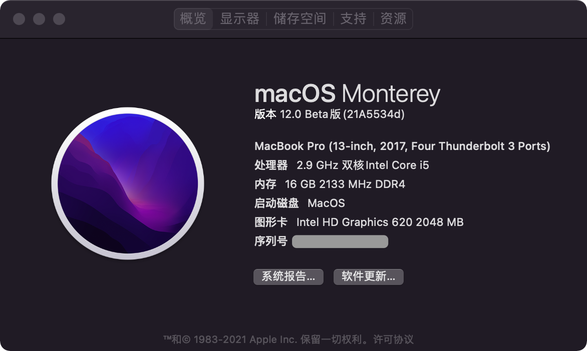

# Hackintosh-EFI-Lenovo-Yoga-910-13IKB

## 介绍  
Lenovo-Yoga-910-13IKB-Hackintosh

## 说明  
联想 Yoga 910-13IKB (4K) 的黑苹果 EFI
当前支持 Monterey 12.3b

 
## 配置  
 规格     | 详细信息
 ---------| --------
 型号     | Lenovo Yoga 910-13IKB
 主板     | Lenovo Agera (7th Generation Intel Processor Family I/O - 9D58 笔记本芯片组)
 处理器   | Intel(R) Core(TM) i7-7500U @ 2.70GHz
 内存     | 16 GB 2133 MHz (三星)
 硬盘     | 三星 MZVLW1T0HMLH-000L2 (1024 GB / 固态硬盘)
 显卡     | Intel HD Graphics 620  (4K屏)
 无线网卡  | 博通 Broadcom 802.11ac Network Adapter (博通 BCM94352Z)
 声卡     | 瑞昱 Audio ALC299
 触摸板   |
 触摸屏   |

## BIOS
 略。  
 
## 使用
不需要额外操作，所有模块均以驱动，如果从其他 EFI 替换，请尝试 RESET NVRAM。
 模块                       | 是否驱动
 -------------------------- | ----------- 
 WiFi（Broadcom BCM94352Z） | ✅
 蓝牙                       | ✅ （有概率连不上设备）
 集显/4k                    | ✅ 
 音频/耳机                  | ✅
 摄像头                     | ✅
 USB/Type-c/HDMI            | ✅
 键盘                       | ✅
 触摸板                     | ✅
 触摸屏                     | ✅
 电源/睡眠                  | ✅
## 预览
    
    
  
## 鸣谢
https://github.com/acidanthera/OpenCorePkg  
https://gitee.com/btwise/OpenCore_NO_ACPI  
